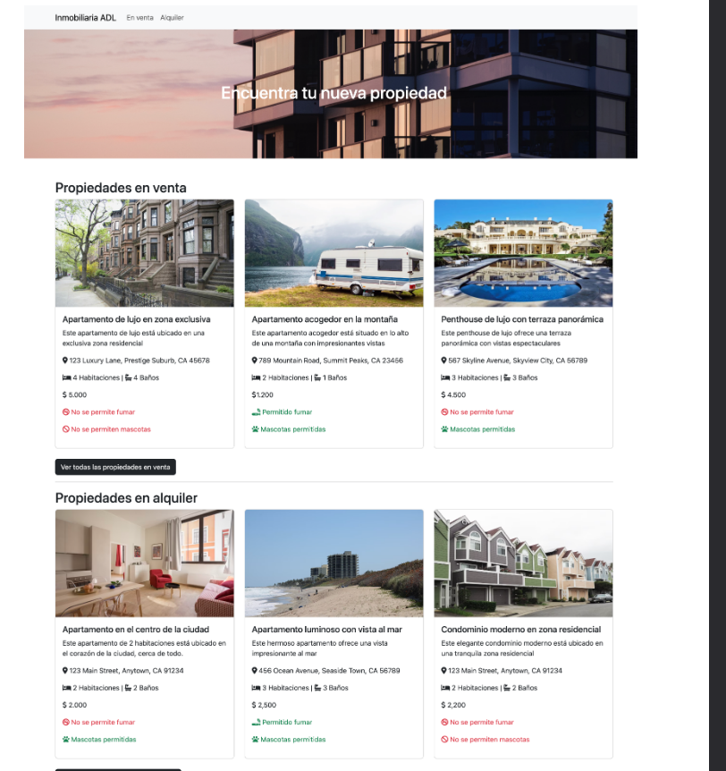

# Proyecto inmobiliaria

En este proyecto implemento la solución utilizando la herramienta Vite que me entrega un scaffolding para desarrollar el proyecto en cuestión.

## ¿Qué debo hacer?

Implementar una app básica utilizando el DOM y arrays como objetos para desplegar la información de casas y/o departamentos para arrendar como para comprar para los usuarios. Este proyecto sólo implementa el frontend enfatizando en el manejo de información desde un arrays y objetos de JS usando el DOM.

Se debe implementar una solución similar a la siguiente:



### Lenguajes y herramientas a utilizar:

1. JavaScript
2. HTML/CSS
3. Vite

## ¿Cómo ejecutar app localmente?

-> **Se recomienda tener instalado node junto a npm**.

1. abrir directorio raíz del proyecto.
2. ejecutar el siguiente comando:
```bash
npm install
```
3. ejecutar el proyecto en localhost:
```bash
npm run dev
```
4. abrir el navegador y dirigirse a la siguiente dirección:
```bash
http://localhost:5173/
```

Ya puedes disfrutas de la app inmobiliaria.